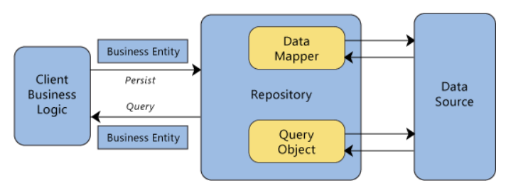

# 問題集

   

## 寫 API 時會大量使用 EntityFrameworkCore 與 Database 做溝通
___

1. Deffered Execution 是什麼意思?
    
    * Query dose no real work until we force the query to produce a result

2. IQueryable & IEnumerable 都提供 Deffered Execution 的服務, 但為什麼與 DbContext 做溝通實選擇 IQueryable 比較好呢?

    * 因為 IEnumerable 在進行 query 時候, 事先把資料從 Database 抓進 Ram 裡面, 在執行 Filter 把不要的資料去掉。
      而 IQueryable 則是要求 database 先把資料 filter 掉在傳回來。
      使用 IQueryable 可以減少記憶體負擔，要加運算負擔也請 database server 給分擔掉了。

3. LINQ 裡面的 Where Clause 其實是一個 IEnumerable(IQueryable) 帶有一個 Func<TSourc, bool> Delegate 當參數的 Exetension method, 請問當時做這些 exetention method 實,要在 return 前面加上什麼關鍵字, 才能使這個 exetension method 呈現 Deffered execution 的狀態?

    * yield 

   

## 實作 REST 時, 因為要完成 data shaping 的功能, Data Transfer Object 有時候必須動態生成
___

4. 請解釋 var & dynamic 的差異?

    * 使用 var 關鍵字定義的物件, 會在編譯時期就做出物件是否具有屬性的檢查, 但 dynamic 關鍵字定義的物件不會。

5. ExpandoObject & dynaimc 的差異?

    * ExpandoObject 具有動態增加和減少 Properties 的能力, 但 dynamic 關鍵字定義的 object 沒有這項能力。

   

## 當處理檔案串流時, 記憶體管理變得十分重要
___

6. 通常在什麼情況下要使用 using statement?

    * 當要建立一個實作了 IDisposable interface 的 object 的時候。
      因為通常這種物件都會持有 unmanaged resources。

7. 什麼是 unmanaged resource?

    * 持有 native resource 的物件, 比如這個物件會向系統索取 Ram 的空間, 當它使用完了 Ram 的空間卻不是釋放掉的話。會引響程序的效能，而 using statement 就是建立一個 生命週期較短的 scope, 讓這種物件只會在這個scope裡持有 unmanaged resource。

   

##　一些不關 c# 語言 但跟 DotNetCore Web Framework 有關的東西
___

8. DotNet Core Web App 裡面大量的使用到了 Dependency Injection，其中它提供了三種 method 做 dependency injection。分別是 AddSingleton, AddScoped & AddTrasient。請問用這三種方式注入 service 有什麼區別?

    * Dependency Injection 是 Design Pattern 裡面 Creational patterns 的一種方式。它主要是一種幫忙把類別注入到依賴類裡面。比如 Controller 需要用到 ILogger 類去做 log 的事情, 那麼這時候你不需要擔心怎麼具建立一個 ILogger的類給 controller使用。使用 DI 的系統會自動幫你處理這種事情。
      切入正題，使用 AddSingletion 的 Service, 會在 server 啟動的那瞬間就把 service 物件建立起來, 每當有 class 依賴它時, 它就把這個始終存在的類未給它。
      使用 AddScoped , 則是每當有使用者對 web 丟出 request 請求時, 才建立server 丟給 依賴方使用, 當request結束時, service 有就臨終了。
      使用 AddTrasient ,則是每當 service 的 method 被呼叫時, 才會短暫的把 service 注入給依賴方, 用一次後即銷毀。

9. 說到 Data Validation 以會怎麼做?
    
    1. Data Annotations
    1. Fluent API
    1. IValidatableObject
    1. ValidationAttribute
    1. 直接 ModelState 上 call AddError method

10. Repository Pattern

    

