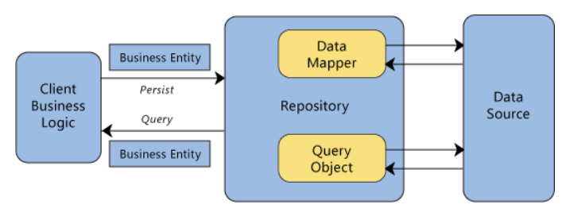

# C# 語言

### Defferred Execution 
___
1. The evaluation of an expression is delayed until its realized value is actually required.
1. It is applicable on any in-memory collection as well as remote LINQ providers like LINQ-to-SQL, LINQ-to-Entities, LINQ-to-XML, etc.
1. 例題1:
    ```c#
    IList<Student> studentList = new List<Student>() {
        new Student() { StudentID = 1, StudentName = "Jhon", age = 18 },
        new Student() { StudentID = 2, StudentName = "Steve", age = 21},
        new Student() { StudentID = 3, StudentName = "Bill", age = 18 }
    };

    // 第一個地方
    var teenAgeStudents = from s in studentList where s.age > 12 && s.age < 20 select s;

    // 第二個地方(Query executed here)
    foreach(Student teenStudent in teenAgeStudents)
        Console.WriteLine("Student Name: {0}",teenStudent.StudentName);

    // Add New Student
    studentList.Add(new Student() { StudentID = 6, StudentName = "Martin", age = 16 });

    // 第三個地方(Query executed again and returns latest data)
    foreach(Student teenStudent in teenAgerStudents)
        Console.WriteLine("Student Name: {0}",teenStudent.StudentName);
    ```
1. 例題2:
    ```c#
    // 第一個地方
    var collection = _context.Post as IQueryable<Post>;

    if (!string.IsNullOrWhiteSpace(postResourceParameter.UserId))
    {
        var userId = postResourceParameter.UserId.Trim();
        // 第二個地方
        collection = collection.Where(p => p.UserId == userId);
    }

    // 第三個地方
    return collection.ToList();
    ```


### GC Memory
___
[Tutorial](https://www.youtube.com/watch?v=e0G5X3bu6hY "The tutorial about IDisposable")
1. Managed Memory
    - Managed memory is typically alloacted when you create a new object()
    - This memory is completely managed by the Garbage Collector and runtime
1. Unmanaged Memoery
    - Umanaged memory is typically allocated by platform invoke methods to open the native resources
    - This memory is not managed by the garbage collector or runtime and must be explicitly freed by the developer
1. Finalizers
    - Allows final cleanup of an object before the object is destroyed, in the event dispose is never called. If Dispose is called, it is not neccessary for a finalizer to run.

1. IDisposable
    - When to use
        * When you create a class that holds references to unmanaged resources
    - How do I know I have unmanaged resources?
        * If your class holds a reference to an object that also implement IDisposable
            - FileStream
            - Bitmap
            - et cetera
        * If you use platform invoke to directly create native resources, such as opening a file
    - 範例:
        ```c#

        private bool _disposed = false;

        public void Dispose()
        {
            // Indicating that the dispose method is called from user code,
            // 這一位著當使用者使用像是 Using statement 的東西或是直接呼叫了 Dispose method,
            // 在這種情況, 不需要靠 Finalizer 去 release resources 而是靠 protected Dispose method 去 release resources
            Dispose(true);
            GC.SuppressFinalize(this);
        }

        protected virtual void Dispose(bool disposing)
        {
            if(disposed)
            {
                return;
            }

            if(disposing)
            {
                // Disposing the resources
            }

            _disposed = true;
        }
        ``` 


# Dotnet Core Framework

### Dependency Injection in .Net Core
___
有三種 Register Sevice 的 Method
1. AddSingleton
1. AddScoped
1. AddTrasient

這三種 method 會讓 Service 有不同的 Scoped Life (答案)
1. With a singleton service, there is only a single instance. An instance is created, when the service is first requested and that single instance is used by all http requests throughout the application.
1. With a scoped service we get the same instance within a scope of a given http request but a new instance across different http requests
1. With a transient service a new instance is provided every time an instance is requested whetaher it is in the scope of the same http request or across different http request


### About Data Annotation
___
1. Data Annotations
1. Fluent API
1. IValidatableObject
1. ValidationAttribute


### Repository Pattern
___
1. Repository pattern C# is a way to implement data access by encapsulating the set of objects persisted in a data store and the operations performed over them, providing a more object-oriented view of the persistence layer.
1. 示意圖

1. 優點
    1. Increase testability
    1. Easily swapped out with various data stores without changing the API

# DotNet Core Identity

### Claim-Base Model (跟身分認證有關)
___
1. Claim
    - 像是證件上面的欄位,比如 Driver Liscence 上的性別欄位
1. ClaimIdentity
    - Like Driver's License, Passport, Credit Card, Google Account etc. 就是向代表 User 的證件
1. ClaimPrincipal
    - User

1. 例子:
```c#
// Step 1
var driverLicenseClaims = new Claim[]
{
    new Claim(ClaimTypes.Name, "Po Jen Su"),
    new Claim(ClaimTypes.Email, "brian71742@gmail.com")
};

// Step 2
var driverLicenseIdentity = new ClaimsIdentity(driverLicenseClaims);

// Step 3
var userPrincipal = new ClaimsPrincipal( new[] { driverLicenseIdentity } );

//Step 4
await HttpContext.SignInAsync(userPrincipal);
```